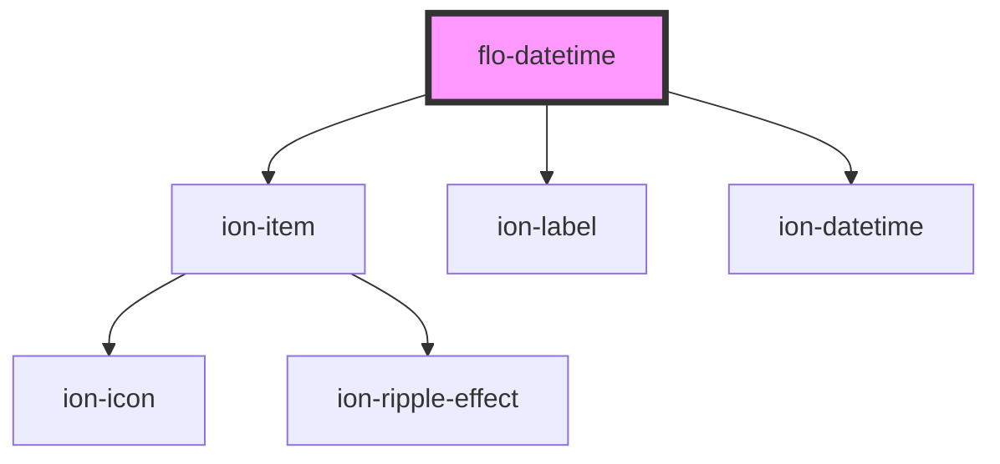

# flo-datetime

<!-- Auto Generated Below -->

## Properties

| Property        | Attribute        | Description | Type     | Default                                         |
| --------------- | ---------------- | ----------- | -------- | ----------------------------------------------- |
| `displayFormat` | `display-format` |             | `string` | `"D MMM YYYY H:mm"`                             |
| `max`           | `max`            |             | `string` | `(new Date().getUTCFullYear() + 10).toString()` |
| `min`           | `min`            |             | `string` | `(new Date().getUTCFullYear() - 10).toString()` |
| `text`          | `text`           |             | `string` | `"Date / Time"`                                 |
| `value`         | `value`          |             | `string` | `new Date().toISOString()`                      |

## Dependencies

### Depends on

- ion-item
- ion-label
- ion-datetime

### Graph

----------------------------------------------

*Built with [StencilJS](https://stenciljs.com/)*
